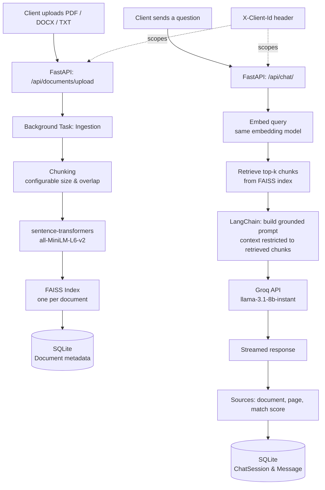

[documind-backend-README.md](https://github.com/user-attachments/files/29173485/documind-backend-README.md)
# DocuMind AI — Backend

The backend for **DocuMind AI**, a Retrieval-Augmented Generation (RAG) platform that turns PDF, DOCX, and TXT documents into a searchable, conversational knowledge base. This is the FastAPI service that handles ingestion, vector retrieval, and LLM-grounded chat for the [DocuMind AI frontend](https://github.com/cs-gitrp/documind-ai).

**Live API:** deployed on Render (see frontend repo for the live demo link)
**Frontend repo:** [github.com/cs-gitrp/documind-ai](https://github.com/cs-gitrp/documind-ai)

---

## How it works

Every uploaded document runs through a real retrieval pipeline, not a shortcut:

1. **Ingestion** — the document is parsed and split into overlapping text chunks (chunk size and overlap are configurable).
2. **Embedding** — each chunk is converted into a vector using `sentence-transformers` (`all-MiniLM-L6-v2`).
3. **Indexing** — vectors are stored in a dedicated **FAISS** index, one per document.
4. **Retrieval** — an incoming question is embedded the same way and matched against the relevant document's vectors to pull the most relevant chunks.
5. **Generation** — the retrieved chunks are passed to **Groq** (`llama-3.1-8b-instant`) via **LangChain**, with the prompt explicitly restricted to the retrieved context — so answers stay grounded in the source document instead of being invented.
6. **Citations** — every response is returned with its sources: document name, exact page number, and a match score, so answers can be verified rather than trusted blindly.

## Architecture



## Tech Stack

- **Framework:** FastAPI (Python)
- **Orchestration:** LangChain
- **Embeddings:** sentence-transformers (`all-MiniLM-L6-v2`)
- **Vector Search:** FAISS (one index per document)
- **LLM Inference:** Groq API (`llama-3.1-8b-instant`)
- **Database:** SQLite (via SQLAlchemy)
- **Deployment:** Render

## API Overview

| Endpoint | Method | Description |
|---|---|---|
| `/api/documents/upload` | POST | Upload and begin ingesting a document |
| `/api/documents/` | GET | List documents |
| `/api/documents/{id}` | PATCH | Rename a document |
| `/api/documents/{id}` | DELETE | Delete a document and its index |
| `/api/documents/{id}/download` | GET | Download or preview a document |
| `/api/chat/` | POST | Send a message and stream a grounded response |
| `/api/chat/sessions` | GET | List chat sessions |
| `/api/chat/sessions/{id}` | GET | Get full message history for a session |
| `/api/chat/sessions/{id}` | DELETE | Delete a chat session |
| `/api/settings/` | GET / PUT | Get or update RAG retrieval settings |
| `/api/settings/storage-stats` | GET | Get current storage usage |
| `/api/settings/storage` | DELETE | Clear stored documents and indexes |
| `/api/search/` | GET | Search across documents and conversations |

## Getting Started

### Prerequisites

- Python 3.10+
- A Groq API key ([console.groq.com](https://console.groq.com))

### Installation

```bash
git clone https://github.com/cs-gitrp/documind-backend.git
cd documind-backend
python -m venv venv
source venv/bin/activate  # On Windows: venv\Scripts\activate
pip install -r requirements.txt
```

### Environment Variables

Create a `.env` file in the project root:

```env
GROQ_API_KEY=your_groq_api_key_here
DATABASE_URL=sqlite:///./data/documind.db
```

### Run locally

```bash
uvicorn main:app --reload --host 0.0.0.0 --port 8000
```

The API will be available at `http://127.0.0.1:8000`, with interactive docs at `http://127.0.0.1:8000/docs`.

## Project Structure

```
documind-backend/
├── routers/
│   ├── chat.py          # Chat, sessions, streaming responses
│   ├── documents.py     # Upload, list, rename, delete, download
│   ├── search.py        # Cross-document/conversation search
│   └── settings.py      # RAG parameter tuning, storage management
├── services/
│   ├── ingestion.py      # Document parsing & chunking
│   ├── embeddings.py     # Sentence-transformer embedding (lazy-loaded singleton)
│   ├── retrieval.py      # FAISS retrieval logic
│   └── llm.py             # Prompt building & Groq streaming
├── models/
│   └── database.py       # SQLAlchemy models (Document, ChatSession, Message, RAGSettings)
├── data/                  # Uploaded files & FAISS indexes (gitignored)
├── config.py
├── main.py
└── requirements.txt
```

## Notes on design decisions

- **Tunable, not just usable** — retrieval parameters (chunk size, overlap, response temperature, response mode) are exposed via the settings endpoint rather than hardcoded, so retrieval behavior can actually be adjusted per use case.
- **Per-browser data isolation** — documents and chat sessions are scoped to an anonymous client identifier sent via an `X-Client-Id` header, so one user's uploads and conversations stay private from another's without requiring full authentication.
- **Lazy model loading** — the embedding model loads as a singleton on first use (CPU-only torch) to stay within free-tier memory limits.
- **Graceful failure handling** — documents that fail to parse (e.g. scanned/image-only PDFs with no extractable text) are marked `failed` with `Pages: 0, Chunks: 0` rather than crashing the pipeline.

## Deployment notes

This backend is deployed on Render's free tier, which spins down on inactivity. The first request after idle time may take longer than usual (cold start) — this is expected behavior, not a bug. Since the SQLite database lives on ephemeral disk, stored documents and chat history reset on service restart by design.

## License

This project is for educational and portfolio purposes.

## Author

**Chandan Singh**
[LinkedIn](https://www.linkedin.com/in/chandan-singh-a23563304/) · [GitHub](https://github.com/cs-gitrp)
