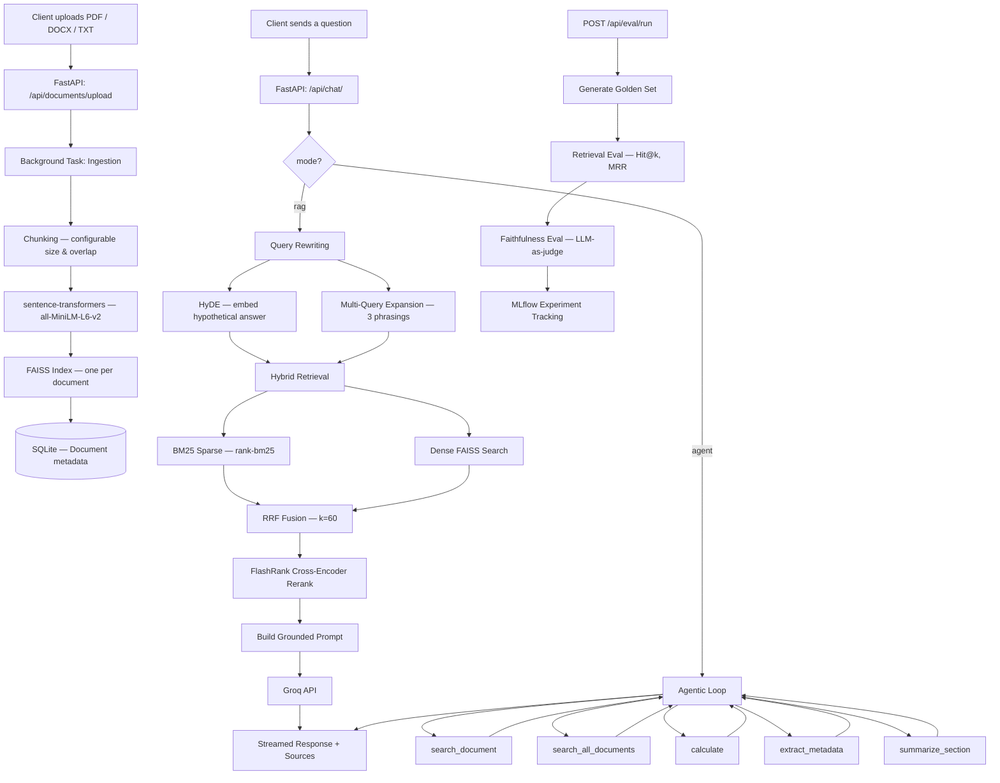

# DocuMind AI — Backend

The backend for **DocuMind AI**, a production-grade Retrieval-Augmented Generation (RAG) platform that turns PDF, DOCX, and TXT documents into a searchable, conversational knowledge base.

This is the FastAPI service handling document ingestion, hybrid vector retrieval, LLM-grounded chat, agentic tool use, and a full RAG evaluation framework.

**Frontend repo:** [github.com/cs-gitrp/documind-ai](https://github.com/cs-gitrp/documind-ai)

---

## What makes this different from a standard RAG tutorial

Most RAG projects: upload PDF → chunk → FAISS cosine search → LLM. That's one step.

This backend implements a full retrieval stack with measured results:

| Metric | Score |
|---|---|
| Retrieval Hit@5 | **100%** |
| MRR (Mean Reciprocal Rank) | **0.9545** |
| Answer Faithfulness (LLM-as-judge) | **77.3%** |

Evaluated on an 11-question golden set with a Groq-hosted judge model.

---

## How it works

### v2 Retrieval Pipeline (4 stages)

```
User Query
    │
    ├── HyDE Query Rewriting
    │   └── LLM generates a hypothetical answer passage
    │       Embed that instead of the raw question
    │
    ├── Stage 1: BM25 Sparse Retrieval     (top-20 by keyword match)
    │
    ├── Stage 2: FAISS Dense Retrieval     (top-20 by vector similarity)
    │
    ├── Stage 3: RRF Fusion                (Reciprocal Rank Fusion, k=60)
    │   └── Rewards chunks appearing in both ranked lists
    │
    └── Stage 4: FlashRank Reranker        (cross-encoder, runs locally)
        └── ms-marco-MiniLM-L-12-v2 → final top-5
```

Replaces naive `FAISS IndexFlatL2` cosine search with an ensemble that catches what each individual retriever misses.

### Agentic Mode

In addition to standard RAG, the chat endpoint supports an agent mode where the LLM drives a tool-calling loop:

```
User Question
    ↓
LLM + Tool Definitions → Groq tool-calling API
    ↓
Tool executes → result appended to context
    ↓
Repeat until no more tool calls (max 6 turns)
    ↓
Final grounded answer
```

### Evaluation Framework

Every pipeline change is measured, not guessed:

```
Golden Set (20 Q&A pairs auto-generated from document chunks)
    ↓
Retrieval Eval  → Hit@k, MRR per question
    ↓
Faithfulness Eval → LLM-as-judge scores each answer
    ↓
Results logged to MLflow + saved to evals/results/
    ↓
CI/CD regression gate: pipeline fails if Hit@5 < 60%
```

---

## Architecture


```mermaid
flowchart TD
    A[Client uploads PDF / DOCX / TXT] --> B[FastAPI: /api/documents/upload]
    B --> C[Background Task: Ingestion]
    C --> D[Chunking — configurable size & overlap]
    D --> E[sentence-transformers — all-MiniLM-L6-v2]
    E --> F[FAISS Index — one per document]
    F --> G[(SQLite — Document metadata)]

    H[Client sends a question] --> I[FastAPI: /api/chat/]
    I --> MODE{mode?}

    MODE -->|rag| QR[Query Rewriting]
    QR --> QR1[HyDE — embed hypothetical answer]
    QR --> QR2[Multi-Query Expansion — 3 phrasings]
    QR1 --> RET
    QR2 --> RET

    RET[Hybrid Retrieval] --> BM25[BM25 Sparse — rank-bm25]
    RET --> DENSE[Dense FAISS Search]
    BM25 --> RRF[RRF Fusion — k=60]
    DENSE --> RRF
    RRF --> RERANK[FlashRank Cross-Encoder Rerank]
    RERANK --> PROMPT[Build Grounded Prompt]
    PROMPT --> LLM[Groq API]
    LLM --> STREAM[Streamed Response + Sources]

    MODE -->|agent| AGENT[Agentic Loop]
    AGENT --> T1[search_document]
    AGENT --> T2[search_all_documents]
    AGENT --> T3[calculate]
    AGENT --> T4[extract_metadata]
    AGENT --> T5[summarize_section]
    T1 & T2 & T3 & T4 & T5 --> AGENT
    AGENT --> STREAM

    EVAL[POST /api/eval/run] --> GS[Generate Golden Set]
    GS --> REVAL[Retrieval Eval — Hit@k, MRR]
    REVAL --> FEVAL[Faithfulness Eval — LLM-as-judge]
    FEVAL --> MFLOW[MLflow Experiment Tracking]
```

---

## Tech Stack

| Layer | Technology |
|---|---|
| Framework | FastAPI (Python 3.11) |
| Embeddings | sentence-transformers `all-MiniLM-L6-v2` |
| Dense Retrieval | FAISS (one index per document) |
| Sparse Retrieval | rank-bm25 (BM25Okapi) |
| Reranking | FlashRank `ms-marco-MiniLM-L-12-v2` (local, no API key) |
| LLM Inference | Groq API |
| Query Rewriting | HyDE + multi-query expansion via Groq |
| Agent Tools | Groq native tool-calling API |
| Evaluation | Custom golden set + LLM-as-judge |
| Experiment Tracking | MLflow |
| Database | SQLite (SQLAlchemy) |
| Containerisation | Docker (multi-stage build) |
| Orchestration | docker-compose (FastAPI + Next.js + PostgreSQL) |
| CI/CD | GitHub Actions → ghcr.io → GCP Cloud Run |

---

## API Overview

### Core

| Endpoint | Method | Description |
|---|---|---|
| `/api/documents/upload` | POST | Upload and begin ingesting a document |
| `/api/documents/` | GET | List documents |
| `/api/documents/{id}` | PATCH | Rename a document |
| `/api/documents/{id}` | DELETE | Delete a document and its index |
| `/api/documents/{id}/download` | GET | Download or preview a document |
| `/api/chat/` | POST | Send a message — stream a grounded response (`mode: "rag"` or `"agent"`) |
| `/api/chat/sessions` | GET | List chat sessions |
| `/api/chat/sessions/{id}` | GET | Full message history for a session |
| `/api/chat/sessions/{id}` | DELETE | Delete a chat session |
| `/api/settings/` | GET / PUT | Get or update RAG retrieval settings |
| `/api/settings/storage-stats` | GET | Current storage usage |
| `/api/settings/storage` | DELETE | Clear all documents and indexes |
| `/api/search/` | GET | Search across documents and conversations |

### Evaluation

| Endpoint | Method | Description |
|---|---|---|
| `/api/eval/golden-set` | POST | Generate or regenerate a Q&A golden set for a document |
| `/api/eval/run` | POST | Run full retrieval + faithfulness evaluation (background task) |
| `/api/eval/status/{doc_id}` | GET | Poll evaluation status |
| `/api/eval/results/{doc_id}` | GET | Fetch latest evaluation results (Hit@k, MRR, faithfulness) |
| `/api/eval/golden-set/{doc_id}` | GET | Inspect the golden Q&A set |

---

## Chat API — mode parameter

```json
POST /api/chat/
{
  "query": "What is the main finding of this study?",
  "document_id": "your-doc-id",
  "mode": "rag",
  "use_hyde": true,
  "use_multi_query": false
}
```

- `mode: "rag"` — hybrid retrieval + reranking + grounded answer (default)
- `mode: "agent"` — agentic loop with tool calling; LLM decides when to search and what to compute
- `use_hyde` — enable HyDE query rewriting (recommended on, default true)
- `use_multi_query` — enable multi-query expansion; higher recall, slower (default false)

Response sources now include `rrf_score` and `rerank_score` per chunk for transparency.

---

## Agent Tools

| Tool | Description |
|---|---|
| `search_document` | Hybrid retrieval (with HyDE) on a specific document |
| `search_all_documents` | Cross-document search across all indexed files |
| `calculate` | Sandboxed Python math evaluator (blocks `exec`, `import`, `os`, `sys`) |
| `extract_metadata` | Returns page count and chunk count for a document |
| `summarize_section` | Returns all chunks from a given page range |

---

## Evaluation Results

Evaluated on a research paper PDF with an 11-question golden set (factual, definition, numerical, and reasoning questions):

```
Hit@5            : 1.0000   (11/11 questions — gold chunk in top-5)
MRR              : 0.9545   (gold chunk ranked first in 10/11 questions)
Faithfulness     : 0.7727   (8 faithful, 1 partially faithful, 2 parse errors)
```

Gold chunk was present at every retrieval stage (dense → BM25 → RRF → reranked → final top-5) for 10 out of 11 questions — confirming that the reranker is not discarding relevant chunks.

---

## Project Structure

```
documind-backend/
├── routers/
│   ├── chat.py           # Chat, sessions, streaming — RAG and agent modes
│   ├── documents.py      # Upload, list, rename, delete, download
│   ├── eval.py           # Evaluation endpoints (golden set, run, results)
│   ├── search.py         # Cross-document/conversation search
│   └── settings.py       # RAG parameter tuning, storage management
├── services/
│   ├── ingestion.py      # Document parsing & chunking
│   ├── embeddings.py     # Sentence-transformer singleton (lazy-loaded)
│   ├── retrieval.py      # Hybrid BM25 + FAISS + RRF + FlashRank reranker
│   ├── query_rewriter.py # HyDE + multi-query expansion
│   ├── agent.py          # Agentic tool-calling loop (5 tools)
│   ├── llm.py            # Prompt building & Groq streaming
│   └── experiment_tracker.py  # MLflow run logging
├── evals/
│   ├── eval_pipeline.py  # Golden set generation, Hit@k, MRR, faithfulness
│   ├── golden/           # Per-document Q&A golden sets (JSON)
│   └── results/          # Per-document eval results (JSON)
├── tests/
│   └── test_retrieval.py # 13 unit tests — RRF, BM25, calculator, eval logic
├── models/
│   └── database.py       # SQLAlchemy models
├── data/                 # Uploaded files & FAISS indexes (gitignored)
├── .github/
│   └── workflows/
│       └── ci.yml        # Lint → test → Docker build → Cloud Run → eval gate
├── Dockerfile            # Multi-stage build, non-root user, model pre-downloaded
├── docker-compose.yml    # FastAPI + Next.js + PostgreSQL
├── config.py
├── main.py
└── requirements.txt
```

---

## Getting Started

### Prerequisites

- Python 3.11+
- A Groq API key ([console.groq.com](https://console.groq.com))
- Docker (optional, for containerised run)

### Local Installation

```bash
git clone https://github.com/cs-gitrp/documind-backend.git
cd documind-backend
python -m venv venv
source venv/bin/activate        # Windows: venv\Scripts\activate
pip install -r requirements.txt
```

### Environment Variables

Create a `.env` file in the project root:

```env
GROQ_API_KEY=your_groq_api_key_here
DATABASE_URL=sqlite:///./data/documind.db
```

### Run locally

```bash
uvicorn main:app --reload --host 0.0.0.0 --port 8000
```

API: `http://127.0.0.1:8000` | Docs: `http://127.0.0.1:8000/docs`

### Run with Docker

```bash
docker build -t documind-backend .
docker run -p 8000:8000 -e GROQ_API_KEY=your_key documind-backend
```

### Run full stack (FastAPI + Next.js + PostgreSQL)

```bash
docker compose up --build
```

### Run unit tests

```bash
pytest tests/ -v
```

Expected: 13/13 passed.

### Run evaluation

```bash
# Generate golden set and run eval via API (Swagger at /docs)
POST /api/eval/golden-set   { "doc_id": "...", "n_questions": 20 }
POST /api/eval/run          { "doc_id": "...", "top_k": 5 }
GET  /api/eval/results/{doc_id}

# Or CLI
python evals/eval_pipeline.py --doc_id <id> --generate_golden --n_questions 20
```

### View MLflow experiment runs

```bash
mlflow ui
# Open http://localhost:5000 to compare Hit@k and faithfulness across runs
```

---

## CI/CD Pipeline

```
Push to main
    ↓
1. Lint (ruff) + Unit Tests (pytest 13/13)
    ↓
2. Docker build → push to GitHub Container Registry (ghcr.io)
    ↓
3. Deploy to GCP Cloud Run (2 vCPU, 2 GB RAM, 80 concurrency)
    ↓
4. RAG Eval Regression Gate
       Hit@5 < 0.60  →  pipeline FAILS
       Faithfulness < 0.65  →  pipeline FAILS
       Results uploaded as GitHub Actions artifact
```

---

## Design Decisions

- **Hybrid retrieval over pure dense** — BM25 catches exact keyword matches that dense embeddings miss (acronyms, model names, numbers). RRF fusion ensures chunks ranking well in both systems surface first.
- **Local reranker** — FlashRank runs a cross-encoder on-device with no API key. Reranking after RRF fusion gives a second pass with a model that jointly scores query+passage rather than comparing embeddings independently.
- **HyDE by default** — embedding a hypothetical answer passage instead of the raw question moves the query vector into "answer space," improving recall especially for definition and factoid questions.
- **LLM-as-judge faithfulness** — using a larger judge model (different from the generation model) to evaluate answers provides a signal that's independent of the generator's own tendencies.
- **Regression gate in CI** — eval metrics are enforced as hard thresholds in the pipeline so retrieval quality can't silently degrade across commits.
- **Per-browser data isolation** — documents and sessions scoped to `X-Client-Id` header without requiring full auth.
- **Lazy model loading** — embedding model loads as a singleton on first use to stay within memory limits on smaller instances.

---

## License

This project is for educational and portfolio purposes.

## Author

**Chandan Singh**
[LinkedIn](https://www.linkedin.com/in/chandan-singh-a23563304/) · [GitHub](https://github.com/cs-gitrp)
